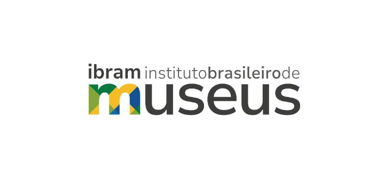

# Desenvolvimento de Tema Personalizado para Ibram

## Sobre este projeto

Este repositório contém o tema personalizado e os plugins que criei para os sites oficiais dos museus vinculados ao Instituto Brasileiro de Museus (IBRAM), desenvolvido como parte do meu trabalho no IBRAM.

**🔗 Para informações detalhadas sobre os plugins, acesse os repositórios dedicados:**  
- [Plugin Barra Oficial do Governo](https://github.com/joaoguiaguiar/plugin-gov-oficial)  
- [Plugin Smartslider Editor Access](https://github.com/joaoguiaguiar/plugin-smartslider-editor-access)  

## Tema Filho Customizado

O projeto teve como principal objetivo a criação de um **tema-filho** baseado no tema Blocksy, replicando o layout do tema anterior, porém com melhorias estruturais, visuais e funcionais.

A escolha do tema Blocksy permitiu integrar personalizações diretamente ao painel administrativo do WordPress, facilitando a manutenção pelos gestores de conteúdo, sem a necessidade de editar o código manualmente.

### Funcionalidades implementadas

- **Integração entre os menus personalizados do tema e o sistema de menus do WordPress**, permitindo total controle dos itens do menu via painel administrativo.
- **Personalização visual diretamente pelo WordPress**, incluindo:
  - Alteração da cor de fundo do menu
  - Tudo isso **sem necessidade de editar o código manualmente**
- **Criação de um widget personalizado**, que permite vincular menus criados em *Aparência > Menus* ao layout do site.
  - O widget possibilita, por exemplo, a exibição de um **menu lateral estilo "menu sanduíche"** sobre o menu do site.
  - Garante **flexibilidade e acessibilidade** à navegação.
- **Utilizando a biblioteca jQuery do JavaScript**, consegui manipular o CSS dos plugins, o que me permitia ter controle total sem mexer no código fonte do plugin, apenas manipulando estilos.

Tudo isso via PHP, sem a necessidade de editar o código manualmente.

## 🌐 Um dos Sites em produção

[https://museuimperial.museus.gov.br/](https://museuimperial.museus.gov.br/)

**⚠️ BLINDAGEM LEGAL:**

- Por questões de **confidencialidade e boas práticas**, este repositório contém **apenas arquivos de minha autoria** e não inclui dados sensíveis.
- O código-fonte pertence integralmente ao **Instituto Brasileiro de Museus (IBRAM)**.
- Este repositório é disponibilizado **exclusivamente para fins de portfólio profissional e demonstração técnica**, com a devida autorização do órgão.
- **É proibida a comercialização (venda) ou redistribuição** do tema e plugins por terceiros.
